# DevOps Project: Multi-Environment Infrastructure with Terraform and Ansible

## Introduction

This comprehensive DevOps project demonstrates how to set up a robust, multi-environment infrastructure using Terraform for provisioning and Ansible for configuration management. The project covers creating infrastructure for development, staging, and production environments, with a focus on automation, scalability, and best practices.

## Project Overview

The project involves:

* Installing Terraform and Ansible
    
* Setting up AWS infrastructure
    
* Creating dynamic inventories
    
* Configuring Nginx across multiple environments
    
* Automating infrastructure management
    
## Project Diagram : 

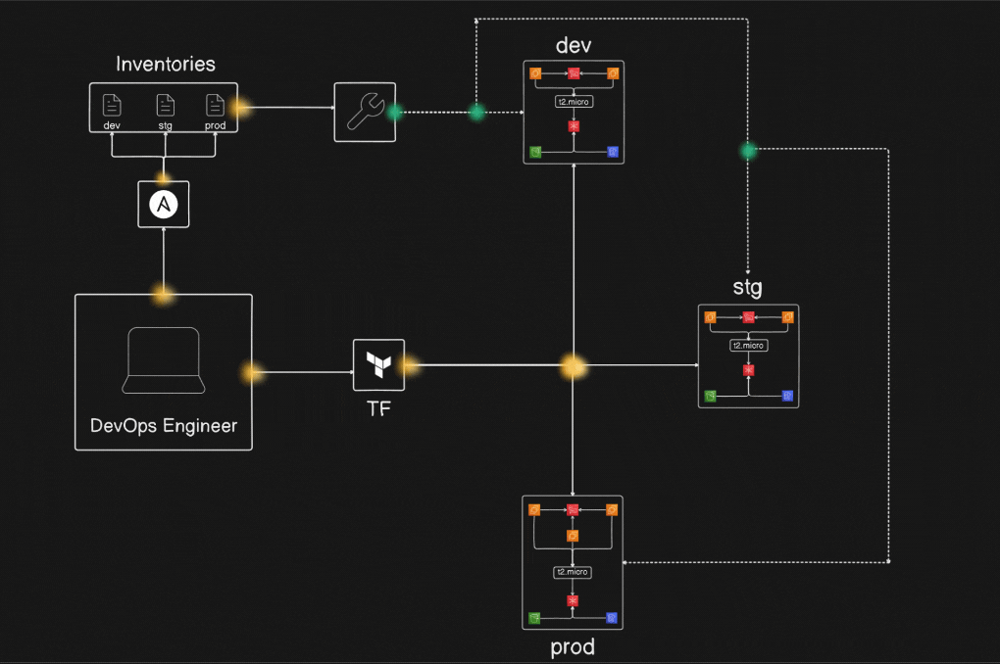


---


# **1\. Installing Terraform and Ansible**

## **a. Installing Terraform on Ubuntu**

Follow these steps to install Terraform on Ubuntu:

1. **Update the Package List**
    
    ```bash
    sudo apt-get update  
    ```
    
2. **Install Dependencies**
    
    ```bash
    sudo apt-get install -y gnupg software-properties-common  
    ```
    
3. **Add HashiCorp's GPG Key**
    
    ```bash
    curl -fsSL https://apt.releases.hashicorp.com/gpg | sudo gpg --dearmor -o /usr/share/keyrings/hashicorp-archive-keyring.gpg  
    ```
    
4. **Add the HashiCorp Repository**
    
    ```bash
    echo "deb [signed-by=/usr/share/keyrings/hashicorp-archive-keyring.gpg] https://apt.releases.hashicorp.com $(lsb_release -cs) main" | sudo tee /etc/apt/sources.list.d/hashicorp.list  
    ```
    
5. **Install Terraform**
    
    ```bash
    sudo apt-get update && sudo apt-get install terraform  
    ```
    
6. **Verify the Installation**
    
    ```bash
    terraform --version  
    ```
    

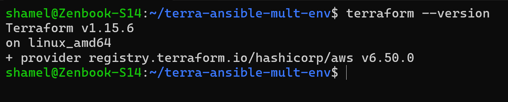

---

## **b. Installing Ansible on Ubuntu**

Ansible simplifies configuration management and automation. To install it:

1. **Add the Ansible PPA**
    
    ```bash
    sudo apt-add-repository ppa:ansible/ansible  
    ```
    
2. **Update the Package List**
    
    ```bash
    sudo apt update  
    ```
    
3. **Install Ansible**
    
    ```bash
    sudo apt install ansible  
    ```
    
4. **Verify the Installation**
    
    ```bash
    ansible --version  
    ```
    

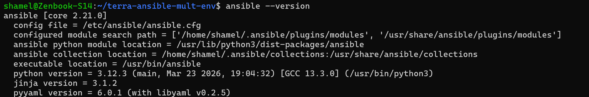

---

# 2\. **Creating Directories for Terraform and Ansible**

To keep your infrastructure code and server configuration scripts organized, create two separate directories: one for Terraform and another for Ansible.

1. **Navigate to Your Project Directory** (or create a new one):
    
    ```bash
    mkdir <your-project-name> && cd <your-project-name>
    ```
    
2. **Create a Directory for Terraform**:
    
    ```bash
    mkdir terraform  
    ```
    
3. **Create a Directory for Ansible**:
    
    ```bash
    mkdir ansible  
    ```
    
4. **Verify the Directory Structure**:
    
    ```bash
    tree  
    ```
    
    Your project structure should look like this:
    
    ```bash
    <your-project-name>/  
    ├── terraform/  
    └── ansible/  
    ```
    

With this structure, you can separate your **Terraform scripts** (infrastructure provisioning) and **Ansible playbooks** (server configuration) efficiently.

---

# 3\. **Setting Up Infrastructure Directory in Terraform**

After creating the `infra` directory, add basic configurations to each Terraform file to provision essential AWS resources.

#### **Steps to Create the Infrastructure Directory and Add File Content**

1. **Navigate to the Terraform Directory**:
    
    ```bash
    cd terraform  
    ```
    
2. **Create the** `infra` Directory:
    
    ```bash
    mkdir infra && cd infra  
    ```
    
3. **Create and Populate the Terraform Files**: below is code which i have used to create infrastructure structure to accomplish project pattern
    

---

**a.** [`bucket.tf`] (S3 Bucket Configuration) : Refer to the source code provided above


---

**b.** [`dynamodb.tf`] (DynamoDB Table for State Locking) : Refer to the source code provided above

---

**c.** [`ec2.tf`] (EC2 Instance Configuration) : Refer to the source code provided above


---

**d.** [`output.tf`] (Output Definitions) : Refer to the source code provided above


---

**e.** [`variable.tf`] (Variable Declarations) : Refer to the source code provided above


---

4. **Verify the File Structure and Content**:
    
    ```bash
    tree  
    ```
    
    Your structure should look like this:
    
    ```bash
    infra/
    ├── bucket.tf  
    ├── dynamodb.tf  
    ├── ec2.tf  
    ├── output.tf  
    └── variable.tf  
    ```
    

Each file now contains sample resource configurations which i have used to create that project. You can modify the values in [`variable.tf`] to fit your project’s requirements.

---

# 4\. **Going Back to Terraform Directory and Adding Main Infrastructure Files**

#### **1\. Go Back to the Terraform Directory**

```bash
cd ..
```

#### **2\. Create the** [`main.tf`] File (Using Modules for Multi-Environment Setup)

The [`main.tf`] file will include the configuration to call your `infra` module and create resources for the `dev`, `stage`, and `prod` environments.

- Refer to the source code provided above


In this [`main.tf`], you're defining three modules (dev, stage, prod) using the same `infra` module, but you can customize them with different settings such as the EC2 instance type, AMI, S3 bucket name, and DynamoDB table name.even display output of Public ips as well.

---

#### **3\. Create the** [`providers.tf`] File (AWS Provider Configuration)

This file configures the AWS provider and sets the region and access credentials.

- Refer to the source code provided above

---

#### **4\. Create the** [`terraform.tf`] File

This file is used for initialising terraform aws provider.

- Refer to the source code provided above

---

#### **5\. Generate SSH Keys (**`devops-key` and [`devops-key.pub`])

> note : here I have used key name as devops-key , you can create with any name , and replace that every-where that old one appears,

To create SSH keys for accessing the EC2 winstances, use the `ssh-keygen` command:

```bash
ssh-keygen -t rsa -b 2048 -f devops-key -N ""
```

* This generates two files:
    
    * `devops-key` (private key)
        
    * [`devops-key.pub`] (public key)
        

---

### **Final Directory Structure**

At this point, your Terraform project structure should look like this:

```bash
├── devops-key        # Private SSH key for EC2 access
├── devops-key.pub    # Public SSH key for EC2 access
├── infra
│   ├── bucket.tf
│   ├── dynamodb.tf
│   ├── ec2.tf
│   ├── output.tf
│   └── variable.tf
├── main.tf           # Defines environment-based modules
├── providers.tf      # AWS provider configuration
├── terraform.tf      # Backend configuration for state management
```

---

### **Next Steps**

1. #### **Run Terraform Commands**
    

Run the following commands to initialize, plan, and apply your Terraform setup:

a. `terraform init` : Initialize Terraform with the required providers and modules

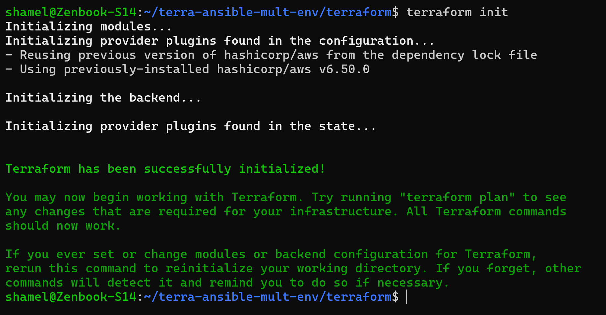

b. `terraform plan` : Review the plan to apply changes

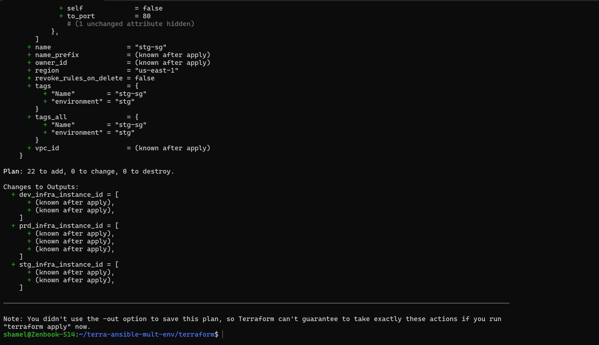

c. `terraform apply` : Apply the changes to provision infrastructur

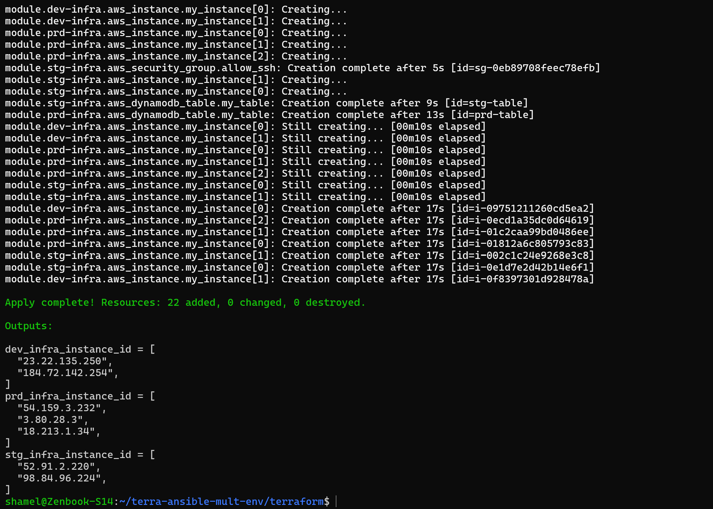

> You can see below that all instance , buckets ,dynamodb are running or created , which is created through Terraform :

1. Instances :
    
    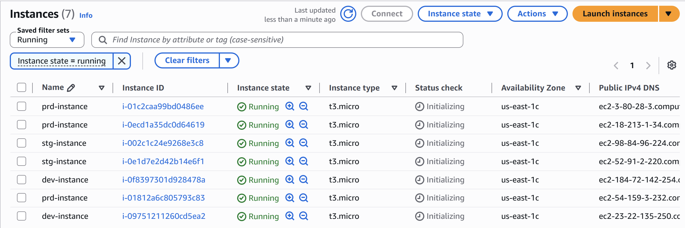
    
2. Buckets :
    
    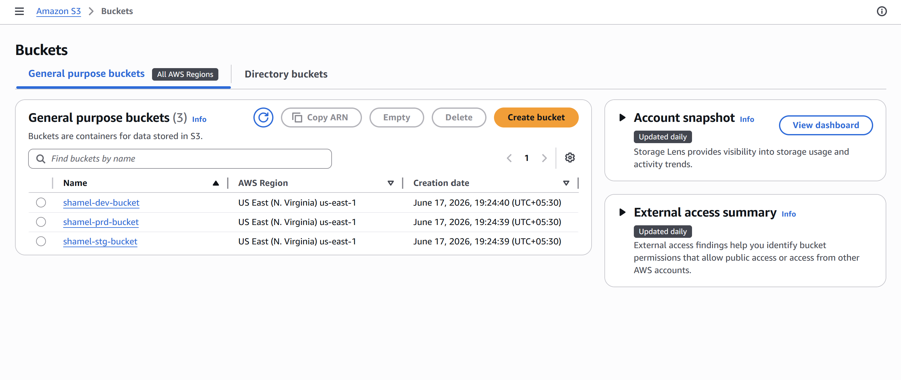
    
3. DynamoDb tables:
    
    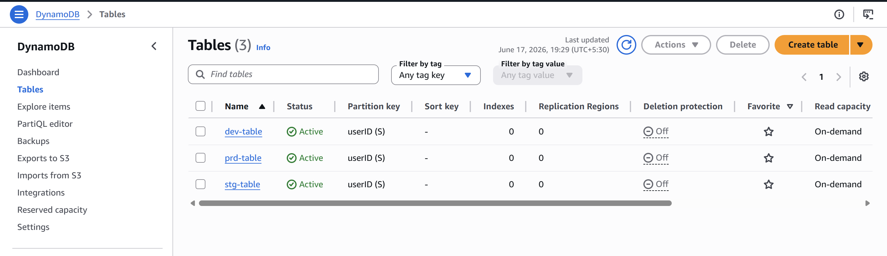
    

---

2. #### **Secure the Private Key**
    

Before using the private key, ensure that it is securely encrypted by setting proper permissions. This prevents other users from accessing it. Run the following command to restrict the access:

```bash
chmod 400 devops-key  # Set read-only permissions for the owner to ensure security
```

This command ensures that the private key (`devops-key`) is only readable by you, preventing others from accessing or modifying it.

3. #### **Access EC2 Instances**
    

After provisioning, you can SSH into the EC2 instances using the generated `devops-key`:

```bash
ssh -i devops-key ubuntu@<your-ec2-ip>
```

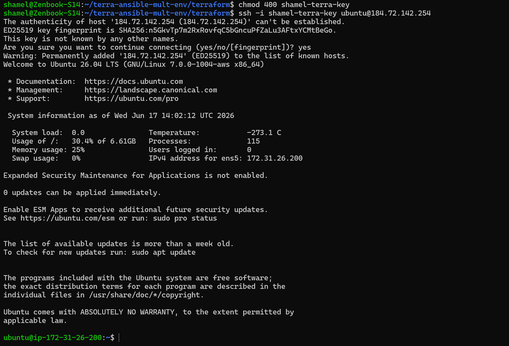

---

> Terraform steps done ,now going to setup with ansible

---

# 5\. Creating dynamic inventories in ansible dir

> Firstly nevigate to ansible dir which would you have created before

---

### **Step 1: Create the Inventories Directory**

```bash
mkdir -p inventories/dev inventories/prod inventories/stg
```

### **Step 2: Add Inventory Content for Each Environment**

#### **For** `inventories/dev`:

- Refer to the source code provided above

#### **For** `inventories/stg`:

- Refer to the source code provided above

#### **For** `inventories/prod`:

- Refer to the source code provided above

---

### **Resulting Directory Structure**

```bash
inventories
├── dev
├── prod
└── stg
```

---

# 6\. Creating playbook for installing Nginx on all servers

### **Step 1: Navigate to the Ansible Directory**

If you're not already in the **Ansible** directory, navigate to it first:

```bash
cd ../ansible
```

---

### **Step 2: Create the** `playbooks` Directory

Create the `playbooks` directory inside the **Ansible** directory:

```bash
mkdir playbooks
```

---

### **Step 3: Navigate to the** `playbooks` Directory

Now, navigate into the `playbooks` directory:

```bash
cd playbooks
```

---

### **Step 4: Create the** `install_nginx_playbook.yml` File

Create the `install_nginx_playbook.yml` file with the following content to install **Nginx** and render a webpage using the `nginx-role`:

- Refer to the source code provided above

---

### **Step 5: Verify the Directory Structure**

After completing the above steps, your **Ansible** directory structure should look like this:

```bash
ansible
├── inventories
│   ├── dev
│   ├── prod
│   └── stg
├── playbooks
│   └── install_nginx_playbook.yml
```

---

# 7\. Now initializing Roles for nginx named nginx-role from ansible galaxy

Here are the steps to initialize the `nginx-role` using **Ansible Galaxy**, which will generate the necessary folder structure for managing all tasks, files, handlers, templates, and variables related to the Nginx role.

---

### **Step 1: Navigate to the** `playbooks` Directory

If you're not already in the `playbooks` directory, navigate to it:

```bash
cd ansible/playbooks
```

---

### **Step 2: Initialize the** `nginx-role` Using Ansible Galaxy

Now, use the `ansible-galaxy` command to initialize the `nginx-role`:

```bash
ansible-galaxy role init nginx-role
```

This will create the following directory structure within the `nginx-role` folder:

```bash
nginx-role
├── README.md
├── defaults
│   └── main.yml
├── files
│   └── index.html
├── handlers
│   └── main.yml
├── meta
│   └── main.yml
├── tasks
│   └── main.yml
├── templates
├── tests
│   ├── inventory
│   └── test.yml
└── vars
    └── main.yml
```

---

### **Step 3: Add Custom Tasks and Files to Your** `nginx-role`

Now that your role structure is ready, you can add your custom **tasks** and **files**.

#### **3.1: Add** `tasks/main.yml`

Create a `tasks/main.yml` file under the `nginx-role/tasks/` directory. This file will contain all the steps to install, configure, and manage the Nginx service. Here's the content for your `tasks/main.yml`:

- Refer to the source code provided above

This will ensure that:

1. **Nginx** is installed with the latest version.
    
2. **Nginx** service is enabled and starts automatically.
    
3. The `index.html` file is copied to the `/var/www/html` directory, which is where the default Nginx webpage is served from.
    

---

#### **3.2: Add a Custom** `index.html` File

You can add an `index.html` file under the `nginx-role/files/` directory. This file can be customized as per your needs. Here's a simplified version of the `index.html` file you provided, with basic content:

- Refer to the source code provided above

> **Note**: You can replace this HTML content with your own custom webpage content as needed. The goal here is to serve a simple webpage as part of the Nginx configuration.

---

# 8\. To add the `update_inventories.sh` script to your Ansible directory and integrate it with your existing setup, follow these steps:

### **Step 1: Create the** `update_inventories.sh` Script

In your `ansible` directory, create a new file named `update_inventories.sh` with the following content. This script will dynamically update the inventory files for **dev**, **stg**, and **prod** environments based on the IPs fetched from the Terraform outputs.

- Refer to the source code provided above

This script will:

1. Navigate to the **Terraform** directory and fetch the public IPs of the instances for **dev**, **stg**, and **prod** environments.
    
2. Dynamically generate or update the corresponding **inventory files** in the `ansible/inventories` directory.
    
3. Add **common variables** for all servers in each environment's inventory file.
    

---

### **Step 2: Verify the Directory Structure**

After adding the script, your `ansible` directory should look like this:

```bash
ansible
├── inventories
│   ├── dev
│   ├── prod
│   └── stg
├── playbooks
│   ├── install_nginx_playbook.yml
│   └── nginx-role
│       ├── README.md
│       ├── defaults
│       │   └── main.yml
│       ├── files
│       │   └── index.html
│       ├── handlers
│       │   └── main.yml
│       ├── meta
│       │   └── main.yml
│       ├── tasks
│       │   └── main.yml
│       ├── templates
│       ├── tests
│       │   ├── inventory
│       │   └── test.yml
│       └── vars
│           └── main.yml
├── update_inventories.sh
```

---

### **Step 3: Make the Script Executable**

Before running the `update_`[`inventories.sh`] script, ensure that it is executable. You can do this by running the following command:

```bash
chmod +x update_inventories.sh
```

---

### **Step 4: Run the Script**

You can now execute the script to update the inventory files with the IPs fetched from Terraform:

```bash
./update_inventories.sh
```

---

### **Step 5: Verify the Inventory Files**

After running the script, check the `inventories` directory. The `dev`, `stg`, and `prod` inventory files should now be updated with the IPs of your servers and the necessary variables.

Example contents of the `dev` inventory file:

```bash
[servers]
server1 ansible_host=192.168.1.10
server2 ansible_host=192.168.1.11

[servers:vars]
ansible_user=ubuntu
ansible_ssh_private_key_file=/home/amitabh/devops-key
ansible_python_interpreter=/usr/bin/python3
```

Repeat this process for **stg** and **prod** environments as well.

---

### **Step 6: Use the Updated Inventory in Playbooks**

Now that your inventory files are updated, you can reference them in your **Ansible playbooks** by using the `-i` option:

1. For **dev** inventory :
    

```bash
ansible-playbook -i inventories/dev install_nginx_playbook.yml
```

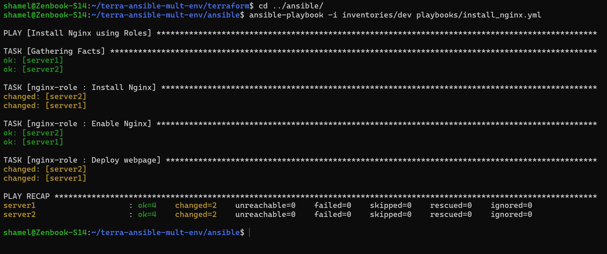


2. For **stg** inventory :
    

```bash
ansible-playbook -i inventories/stg install_nginx_playbook.yml
```

3. For **prod** inventory
    

```bash
ansible-playbook -i inventories/prod install_nginx_playbook.yml
```

This will execute the playbook using the updated **all(dev,stg,prod)** inventory.

---

### **Step 7: verify all the servers whether html page is visible or not (for all inventory like : dev,stg,prod):**

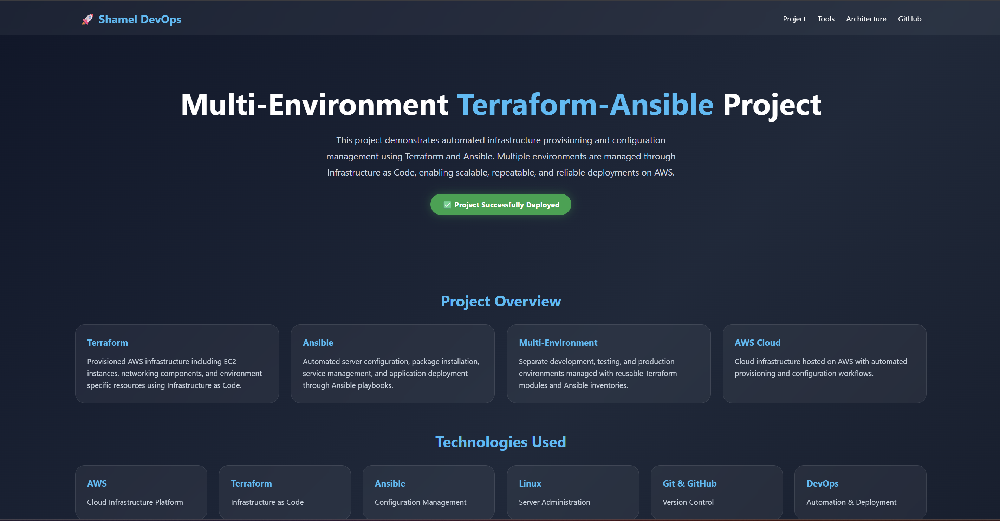

---

# 9\. Final Directory structure for this project

```css
.
├── README.md
├── ansible
│   ├── inventories
│   │   ├── dev
│   │   ├── prod
│   │   └── stg
│   ├── playbooks
│   │   ├── install_nginx_playbook.yml
│   │   └── nginx-role
│   │       ├── README.md
│   │       ├── defaults
│   │       │   └── main.yml
│   │       ├── files
│   │       │   └── index.html
│   │       ├── handlers
│   │       │   └── main.yml
│   │       ├── meta
│   │       │   └── main.yml
│   │       ├── tasks
│   │       │   └── main.yml
│   │       ├── templates
│   │       ├── tests
│   │       │   ├── inventory
│   │       │   └── test.yml
│   │       └── vars
│   │           └── main.yml
│   └── update_inventories.sh
└── terraform
    ├── infra
    │   ├── bucket.tf
    │   ├── dynamodb.tf
    │   ├── ec2.tf
    │   ├── output.tf
    │   └── variable.tf
    ├── main.tf
    ├── providers.tf
    ├── terraform.tf
    ├── terraform.tfstate
    └── terraform.tfstate.backup
```

---

# 10\. **Infrastructure Destroy**

After successfully implementing and managing your infrastructure across multiple environments with Terraform and Ansible, it's time to clean up and destroy all the resources that were provisioned. This step ensures that no resources are left running, which helps avoid unnecessary costs.

To destroy the infrastructure, follow these simple steps:

1. **Navigate to the Terraform Directory:** Go to the directory where your Terraform configuration files are located. This is typically where your [`main.tf`](http://main.tf) file and other Terraform scripts are present.
    
    ```bash
    cd /path/to/terraform/directory
    ```
    
2. **Run Terraform Destroy:** Execute the following command to destroy all the resources that were created by Terraform. The `--auto-approve` flag ensures that you won’t be prompted to confirm the destruction.
    
    ```bash
    terraform destroy --auto-approve
    ```
    
    This command will:
    
    * Destroy all EC2 instances
        
    * Delete all S3 buckets
        
    * Remove any databases or other resources provisioned during the setup
        
    
    Once the command finishes executing, your infrastructure will be completely torn down, and you will have successfully cleaned up all resources.
    

This is the final step to ensure that you have a well-managed infrastructure setup that can be recreated anytime using Terraform and Ansible.

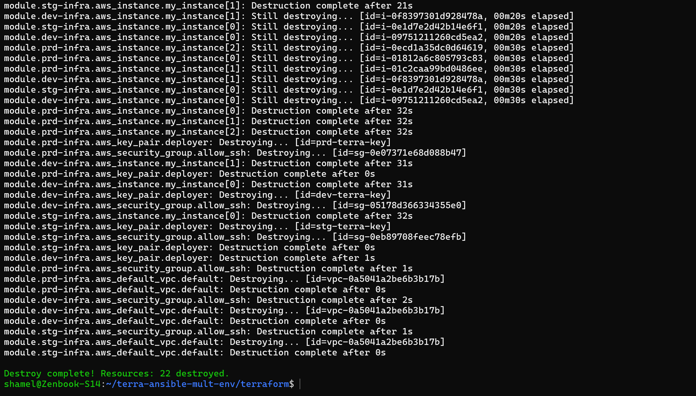

---

**Note:** Be cautious when running `terraform destroy` as it will remove all resources, and data in your infrastructure will be lost. Always ensure that you’ve backed up any important data before performing the destruction.

---

### **Conclusion of the Project**

Congratulations on successfully implementing and managing a multi-environment infrastructure with Terraform and Ansible! Here's a quick recap of what you've achieved:

1. **Infrastructure Setup with Terraform:**
    
    * You began by defining your infrastructure using Terraform, which included provisioning EC2 instances, S3 buckets, and databases across multiple environments: development, staging, and production.
        
    * You followed best practices in managing these resources using Terraform's modular approach and state management.
        
2. **Automating Server Configuration with Ansible:**
    
    * After setting up your infrastructure, you leveraged Ansible for configuration management. You initialized and structured an Nginx role using Ansible Galaxy, allowing you to efficiently manage the installation and configuration of Nginx across all environments.
        
    * You also created dynamic inventories for each environment, making it easy to manage server configurations in a scalable way.
        
3. **Environment-Specific Configurations:**
    
    * By dynamically fetching IPs from Terraform outputs and updating your Ansible inventories, you ensured that each environment had its own specific configuration, enabling streamlined management of resources across dev, staging, and production environments.
        
4. **Simplified Infrastructure Management:**
    
    * With Ansible, you automated the installation, configuration, and updates of necessary software (like Nginx), reducing manual effort and human error.
        
    * The use of Terraform and Ansible together allowed you to achieve both infrastructure provisioning and configuration management in a clean, reproducible, and automated way.
        
5. **Final Cleanup:**
    
    * As a final step, you executed the `terraform destroy` command to tear down the infrastructure that was created. This ensured that you could clean up all resources, including instances, databases, and storage, once the project was completed.
        

---

This project has provided you with hands-on experience in managing infrastructure and configurations for multiple environments using industry-standard tools like Terraform and Ansible. You have successfully automated your infrastructure management, from provisioning to configuration, across different environments.

You can now apply these skills to any real-world scenario, ensuring that infrastructure is managed efficiently, securely, and consistently across any environment.